# Work Time Calc — UX Redesign Plan

**Goal:** Replace the dense, dual-mode UI with a fluid, intuitive 3-tab experience that preserves every feature while reducing cognitive load through progressive disclosure, unified information architecture, and Material 3 patterns.

**Scope:** Plan only — no code changes yet.

---

## 1. Information Architecture

### Problem
Auto Tracking and Manual Tracking are parallel worlds sharing one `targetWorkMinutes` but splitting attention, settings, and mental models. Users must guess which tab to open.

### Solution: **Today · Plan · Focus**

| Tab | Label | Purpose | Replaces |
|-----|-------|---------|----------|
| **Today** | `Today` | Live work-day dashboard: progress, punch, session log, quick leave-time hint | `SessionScreen` (Auto) + punch/status from Auto |
| **Plan** | `Plan` | Schedule inputs + leave-time calculator + day timeline | `ManualScreen` |
| **Focus** | `Focus` | Pomodoro + tasks (unchanged role) | `FocusScreen` |

### Cross-cutting surfaces (not tabs)
- **Settings sheet** — work target, auto-tracking toggle, WiFi SSID, lock sessions (with explanation)
- **Alarm overlay** — global, unchanged behavior
- **Permissions** — deferred until feature is needed (WiFi setup, notifications)

### Shared data (unchanged backend)
- `WorkViewModel.kt` remains single source of truth
- `PreferencesHelper.kt`, `SessionDao`, `WifiMonitoringService`, `AutoPunchManager` — no logic changes in Phase 1–2

---

## 2. Navigation Flow

```mermaid
flowchart TB
    subgraph App["MainContainer"]
        Nav["Material3 NavigationBar"]
        Nav --> Today
        Nav --> Plan
        Nav --> Focus
    end

    Today["TodayScreen"]
    Plan["PlanScreen"]
    Focus["FocusScreen"]

    Today --> Hero["Hero: ProgressRing + worked/target"]
    Today --> Punch["Punch In/Out FAB"]
    Today --> Status["Status pill: clocked in/out + live timer"]
    Today --> LeaveHint["Leave-at chip from manualCalculationState"]
    Today --> LogPreview["Session log preview (2 items)"]
    Today --> SettingsIcon["⚙ → SettingsSheet"]

    LogPreview --> LogSheet["SessionLogSheet (full list)"]
    LogSheet --> EditDlg["EditSessionDialog"]
    LogSheet --> Export["Excel export"]
    LogSheet --> Clear["Clear day confirm"]

    SettingsIcon --> SettingsSheet
    SettingsSheet --> Target["Work target picker"]
    SettingsSheet --> AutoToggle["Auto-tracking on/off"]
    SettingsSheet --> Wifi["WiFi SSID config"]
    SettingsSheet --> Lock["Lock sessions + tooltip"]
    SettingsSheet --> Perms["Permission rationale cards"]

    Plan --> Times["Arrival / Lunch out / Lunch in cards"]
    Plan --> Timeline["DayTimelineBar"]
    Plan --> LeaveCard["Leave-at hero card"]
    Plan --> TargetRO["Target (read-only, tap → Settings)"]

    Focus --> Pomo["Pomodoro ring + controls"]
    Focus --> Tasks["Todo list"]
    Focus --> Landscape["Landscape timer-only layout"]

    App --> Alarm["AlarmDialog overlay"]
```



---

## 3. Screen-by-Screen Redesign

### 3.1 Today Screen (replaces SessionScreen)

**Layout (top → bottom, minimal scroll on first paint):**

1. **App bar** — `Today` title + date subtitle + settings `IconButton` (48dp)
2. **Hero card** (single `WorkProgressRing` ~140dp) — % complete, worked duration, target (tap target → opens Settings sheet at target row)
3. **Primary action row** — large Punch In / Punch Out `FilledTonalButton` (min 56dp height) + compact Lock chip beside it with label "Lock" + `Switch` or tappable chip with one-line explanation on first use
4. **Status strip** — green/gray dot + "Clocked in since 9:02 · 2h 14m" (replaces scattered pills)
5. **Leave-at chip** — `Leave at 6:15 PM` sourced from `viewModel.manualCalculationState` — bridges Plan tab without duplicating Manual tab; tap navigates to Plan tab
6. **Session log preview** — show max 2 recent sessions + "View all (N)" → opens `SessionLogSheet`
7. **WiFi banner** — only when disconnected AND auto-tracking on: slim dismissible banner "Not on work WiFi" → tap opens WiFi section in Settings sheet (hide full `WifiConnectionCard` from main scroll)

**Progressive disclosure:**
- Full session list → bottom sheet
- WiFi technical details → Settings sheet
- Work target edit → Settings sheet (not inline micro-edit on ring card)
- Excel export + Clear day → inside SessionLogSheet header actions

**Remove from main Today scroll:**
- Duplicate thin progress bar (ring is sufficient)
- Full `WifiConnectionCard` inline block
- Emoji section headers (`📋 SESSION LOG`)

---

### 3.2 Plan Screen (replaces ManualScreen)

**Layout:**

1. **App bar** — `Plan` + subtitle "Schedule & leave time"
2. **Leave-at hero** — large red-tinted card (current "Leave at" card promoted to top — the primary reason users open this tab)
3. **Time inputs** — 3 tappable cards (Arrival full-width, Lunch out/in side-by-side); labels use Material icons, not emoji
4. **Day timeline** — single `DayTimelineBar` (segmented bar); remove redundant summary row above it and footer line below stats
5. **Required work** — one stat row: "Required: 8h 30m" with tap → Settings sheet

**Remove:**
- Duplicate arrival/leave text in summary bar + footer
- Separate "Required work" + "Leave at" twin cards (leave-at is hero; required is one line)
- `🕒 SET RECENT TIMES` emoji header → `Schedule` section label via `ListHeader` style

---

### 3.3 Focus Screen (polish, same features)

**Changes only:**
- Stop hiding status bar in portrait; use `statusBarsPadding()` consistently (keep `FLAG_KEEP_SCREEN_ON` when timer running)
- Replace fixed `tween(250)` tab crossfade with shared spring spec
- Task list: collapse behind "Tasks (N)" expandable section when timer running (optional Phase 3)
- Landscape: unchanged split layout

---

### 3.4 Global Overlays

| Surface | Pattern | Notes |
|---------|---------|-------|
| Settings | `ModalBottomSheet` | Target, auto-track, WiFi, lock, permissions status |
| Session log (full) | `ModalBottomSheet` (expanded) or `NavigationSuite` detail | Edit/delete per row |
| Alarm | Keep existing `Dialog` | Move to `AlarmDialog.kt` |
| Confirmations | Compose `AlertDialog` | Replace `android.app.AlertDialog` |
| Time pick | Compose `TimePicker` in dialog | Replace `TimePickerDialog` |
| Duration pick | Custom Compose stepper/slider (hours + minutes) | Replace clock-based `showDurationPicker` |

---

## 4. Component Extraction — File Structure

Target: `MainActivity.kt` ≤ 50 lines (activity shell only).

```
app/src/main/java/com/example/
├── MainActivity.kt                          # onCreate, isForeground flag only
├── navigation/
│   ├── AppNavigation.kt                     # NavigationTab enum → Today/Plan/Focus
│   └── MainContainer.kt                     # Scaffold, Crossfade, alarm overlay host
├── ui/
│   ├── components/
│   │   ├── AppBottomBar.kt                  # Material3 NavigationBar (replaces CustomBottomNavigation)
│   │   ├── WorkProgressRing.kt              # Shared ring canvas (Today + optional Plan)
│   │   ├── StatusPill.kt                    # Clocked-in/out live status
│   │   ├── LeaveAtChip.kt                   # Compact leave-time display
│   │   ├── SessionLogItem.kt                # Single session row
│   │   ├── TimeInputCard.kt                 # Reusable tappable time card
│   │   └── SectionHeader.kt                 # Typography-only section labels
│   ├── screens/
│   │   ├── today/
│   │   │   ├── TodayScreen.kt
│   │   │   ├── TodayHeroSection.kt
│   │   │   └── PunchActionBar.kt
│   │   ├── plan/
│   │   │   ├── PlanScreen.kt
│   │   │   ├── DayTimelineBar.kt            # Extract segmented bar from ManualScreen
│   │   │   └── LeaveHeroCard.kt
│   │   └── focus/
│   │       ├── FocusScreen.kt
│   │       ├── PomodoroControls.kt
│   │       ├── PomodoroModeSelector.kt
│   │       └── TaskListSection.kt
│   ├── sheets/
│   │   ├── SettingsSheet.kt                 # Target, auto, WiFi, lock
│   │   ├── WifiSetupSection.kt              # Extract from WifiConnectionCard
│   │   └── SessionLogSheet.kt               # Full log, export, clear
│   ├── dialogs/
│   │   ├── AlarmDialog.kt
│   │   ├── EditSessionDialog.kt             # Move from MainActivity.kt:1760
│   │   ├── ConfirmDialog.kt                 # clear/delete
│   │   ├── ComposeTimePickerDialog.kt
│   │   └── DurationPickerDialog.kt
│   ├── theme/                               # Existing Color.kt, Theme.kt, Type.kt
│   └── viewmodel/                           # Existing WorkViewModel.kt
├── export/
│   └── ExcelExporter.kt                     # generateLogSheetXlsx from MainActivity.kt:2602
└── utils/                                   # Unchanged
```

### Extraction map (current → new)

| Current location | Lines (approx) | New file |
|------------------|------------------|----------|
| `NavigationTab`, `MainContainer` | 163–332 | `navigation/AppNavigation.kt`, `navigation/MainContainer.kt` |
| `CustomBottomNavigation` | 335–437 | `ui/components/AppBottomBar.kt` |
| `ManualScreen` | 441–791 | `ui/screens/plan/PlanScreen.kt` + `DayTimelineBar.kt` |
| `SessionScreen` | 797–1447 | `ui/screens/today/TodayScreen.kt` + sections |
| `WifiConnectionCard` | 1450–1668 | `ui/sheets/WifiSetupSection.kt` |
| `showTimePicker`, `showDurationPicker`, confirmations | 1670–1758 | `ui/dialogs/*` |
| `EditSessionDialog` | 1760–1999 | `ui/dialogs/EditSessionDialog.kt` |
| `FocusScreen` | 2002–2600 | `ui/screens/focus/*` |
| `generateLogSheetXlsx` | 2602–end | `export/ExcelExporter.kt` |

---

## 5. Fluid UI Patterns to Apply

| Pattern | Where | Implementation |
|---------|-------|----------------|
| **Material3 NavigationBar** | Bottom nav | Replace custom `Surface`+`Row`; 48dp min touch targets; indicator animation |
| **ModalBottomSheet** | Settings, session log, WiFi detail | `rememberModalBottomSheetState`, drag handle, `skipPartiallyExpanded` for log |
| **Spring animations** | Tab crossfade, ring progress, sheet enter | `spring(dampingRatio = 0.8f)` instead of `tween(250)` |
| **AnimatedContent** | Punch button in↔out, clocked status | Label + color morph on state change |
| **Progress semantics** | Hero ring | `Modifier.semantics { progressBarRangeInfo }` for a11y |
| **Floating action** | Punch In/Out | Consider `ExtendedFloatingActionButton` anchored above nav bar on Today only |
| **Elevation layers** | Cards | `Card(elevation = CardDefaults.cardElevation(2.dp))` — hero 4.dp |
| **Typography scale** | Hierarchy | Hero time 40sp, % 32sp, section 12sp caps, body 14–16sp |
| **Permission rationale** | Before system dialog | In Settings sheet: "Location needed for WiFi name" card with Grant button |
| **No emoji headers** | All screens | Material icons (`Icons.Outlined.Schedule`, etc.) |
| **Compose-only dialogs** | All pickers/confirms | Eliminate `android.app.AlertDialog` / `TimePickerDialog` mix |

---

## 6. Feature Preservation Matrix

| Feature | Current location | New location | Notes |
|---------|------------------|--------------|-------|
| Progress ring | `SessionScreen` | `TodayScreen` → `WorkProgressRing` | Shared component |
| Work target edit | Inline on SessionScreen | `SettingsSheet` | Same `updateTargetWorkMinutes` |
| Punch in/out | `SessionScreen` buttons | `TodayScreen` → `PunchActionBar` | Primary CTA |
| Lock sessions | `SessionScreen` icon | `SettingsSheet` + compact chip on Today | Add explanation text |
| Auto-tracking toggle | Session header icon | `SettingsSheet` | Same `toggleAutoTracking` |
| WiFi auto punch | `WifiConnectionCard` | `SettingsSheet` → `WifiSetupSection` | Banner on Today when disconnected |
| WiFi SSID config | `WifiConnectionCard` | `WifiSetupSection` | Same `updateWorkSsid` |
| Live timer | Status pill | `StatusPill` on Today | Same `liveActiveElapsedSeconds` |
| Session log list | `SessionScreen` scroll | `SessionLogSheet` | Preview on Today |
| Session edit | `EditSessionDialog` | `EditSessionDialog` (extracted) | Unchanged logic |
| Session delete | Log row + confirm | `SessionLogSheet` | Compose confirm dialog |
| Excel export | Log header icon | `SessionLogSheet` toolbar | `ExcelExporter.kt` |
| Clear day | Log header link | `SessionLogSheet` menu | Compose confirm |
| Alarms (target reached) | `MainContainer` dialog | `AlarmDialog` | Unchanged `activeAlarm` flow |
| Midnight reset | `WorkViewModel` | No UI change | Backend only |
| Arrival time | `ManualScreen` | `PlanScreen` | `TimeInputCard` |
| Lunch out/in | `ManualScreen` | `PlanScreen` | Same pickers |
| Leave time calculator | `ManualScreen` stats | `PlanScreen` hero + `LeaveAtChip` on Today | Single source: `manualCalculationState` |
| Segmented timeline | `ManualScreen` | `DayTimelineBar` | Simplified context |
| Shared work target | Both tabs | `SettingsSheet` | One edit surface |
| Pomodoro 25/5/10/15 | `FocusScreen` | `PomodoroModeSelector` | Unchanged modes |
| Start/pause/reset | `FocusScreen` | `PomodoroControls` | |
| ±5 min adjust | `FocusScreen` | `PomodoroControls` | |
| Keep screen on | `FocusScreen` DisposableEffect | `FocusScreen` | Only when timer running (improvement) |
| Todo add/complete/delete | `FocusScreen` | `TaskListSection` | |
| Landscape mode | `FocusScreen` | `FocusScreen` | |
| Permissions | Launch in `MainContainer` | On-demand from Settings | Location, notifications |
| Notifications | `NotificationHelper` | No UI change | |
| `WifiMonitoringService` | Background | No UI change | |
| Test tags (`arrival_card`, etc.) | `ManualScreen` | Preserve on `PlanScreen` cards | For existing tests |

---

## 7. Phased Implementation

### Phase 1 — Quick wins (1–2 days)
*Visible UX improvement without file split.*

1. Rename tabs: Auto → **Today**, Manual → **Plan** in `CustomBottomNavigation`
2. Remove emoji section headers; use text + icons
3. Defer permission launch — move `LaunchedEffect` permission block to WiFi section first-open
4. Focus: restore status bar in portrait; keep screen on only when `pomodoroIsRunning`
5. Replace `tween(250)` Crossfade with `spring` in `MainContainer`
6. Manual: remove footer duplicate line + summary bar above timeline
7. Session: collapse `WifiConnectionCard` into slim banner when on work WiFi (card only in disconnect state → still inline for Phase 1)

**Files touched:** `MainActivity.kt` only

---

### Phase 2 — Restructure (3–5 days)
*Architecture + progressive disclosure.*

1. Extract files per §4 structure (bottom-up: dialogs → components → screens → navigation)
2. Implement `SettingsSheet` — consolidate target, auto-toggle, WiFi, lock
3. Implement `SessionLogSheet` — move log, export, clear, edit entry point
4. Build `TodayScreen` hero-first layout; reduce scroll depth
5. Build `PlanScreen` with leave-at hero + simplified timeline
6. Replace all Android `AlertDialog`/`TimePickerDialog` with Compose dialogs
7. Implement `DurationPickerDialog` (hour/minute stepper, not clock)
8. Swap `CustomBottomNavigation` → Material3 `NavigationBar` in `AppBottomBar.kt`
9. Slim `MainActivity.kt` to activity shell

**Files touched:** New packages under `navigation/`, `ui/`, `export/`; gut `MainActivity.kt`

---

### Phase 3 — Polish (2–3 days)
*Motion, a11y, edge cases.*

1. `AnimatedContent` for punch button and status pill state transitions
2. Ring progress animate with `animateFloatAsState(spring(...))`
3. Settings sheet: permission rationale cards with deep-link to system settings
4. Lock first-use tooltip / one-time `Snackbar` explaining auto-punch freeze
5. Focus: optional collapsible task list while timer runs
6. Add `WorkProgressRing` content description and progress semantics
7. Review landscape + foldable layouts for Today/Plan
8. Update/add Compose UI tests for new test tags and sheet flows

---

## 8. Success Criteria

- [ ] First paint on **Today** fits hero + punch + status without scrolling (phone portrait)
- [ ] User can reach every feature in ≤ 2 taps from any tab
- [ ] No `android.app.AlertDialog` or `TimePickerDialog` remain
- [ ] `MainActivity.kt` < 60 lines
- [ ] All existing `WorkViewModel` APIs still used (no feature regression)
- [ ] `testTag("arrival_card")` and session flows still testable

---

## 9. Risks & Mitigations

| Risk | Mitigation |
|------|------------|
| Users miss WiFi setup when card removed | Disconnect banner on Today + Settings entry |
| Settings sheet overload | Group into accordion sections: **Schedule**, **Automation**, **Sessions** |
| Manual tab users lose muscle memory | Plan tab keeps same time cards; leave-at more prominent |
| Large refactor breaks alarms/export | Extract `ExcelExporter` first with unit test; manual QA checklist from matrix §6 |
| Permission deferral breaks auto-punch on first install | Show onboarding card on Today first launch |

---

## 10. Recommended First PR

**Title:** `refactor(ui): extract navigation and Today screen shell`

1. Create `navigation/` + `ui/components/AppBottomBar.kt`
2. Move `SessionScreen` → `TodayScreen` (rename only, no layout change)
3. Move `ManualScreen` → `PlanScreen` (rename only)
4. PR stays reviewable; layout redesign lands in follow-up PRs per phase
